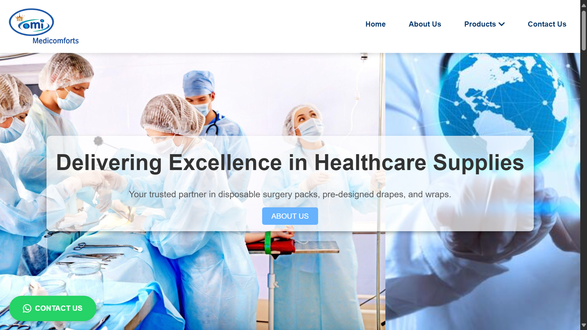
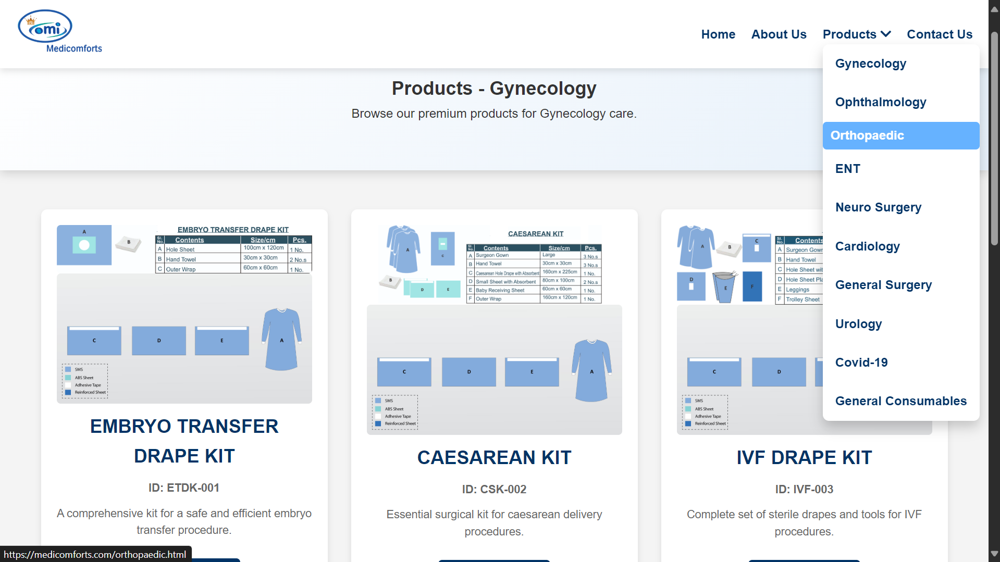
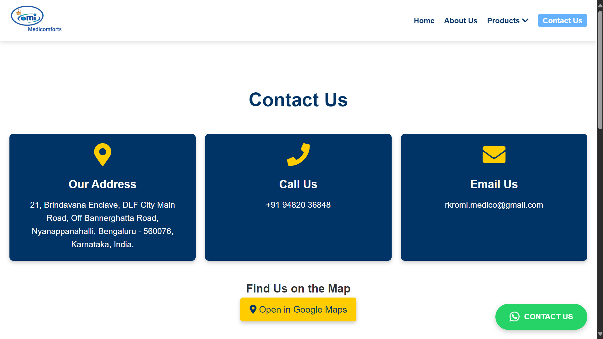

# 🏥 MediComforts - Medical Supplier Company Website

> 💼 Freelance Web Development Project  
> **Client:** RKR MediComforts Healthcare Solutions  
> **Role:** Full Stack Developer (Student Freelancer)  
> **Website:** [https://medicomforts.com](https://medicomforts.com)

---

## 📌 Project Overview

**MediComforts** is a medical supplies and surgical disposables company aiming to provide custom drape packs and wraps for hospitals and clinics. As part of this freelance project, I designed and developed a professional business website that showcases the company’s product portfolio, company profile, and contact information.

This project was completed independently as a **student freelancer**, following industry standards in responsive design, secure hosting, and SEO basics.

---

## 🎯 Client Requirements

- ✅ Company profile homepage with custom content  
- ✅ Product listing for surgical drape packs, gowns, wraps, etc.  
- ✅ Contact form with email delivery  
- ✅ Modern and responsive layout (mobile-friendly)  
- ✅ Secure deployment using HTTPS  
- ✅ SEO-friendly URLs and metadata  
- ✅ Admin panel (optional future scope)  
- ✅ Hosting support and domain integration (medicomforts.com)

---

## 🛠️ Technologies Used

| Technology      | Purpose                                |
|----------------|----------------------------------------|
| **HTML5**       | Markup structure                       |
| **CSS3**        | Styling and layout                     |
| **JavaScript**  | Frontend interactivity                 |
| **PHP**         | Backend form handling and email        |
| **MySQL**       | User DB
| **Hostinger**   | Hosting and domain configuration       |
| **cPanel/FTP**  | File deployment and maintenance        |
| **Google Fonts / Icons** | UI/UX enhancement             |

---

<h2>📸 Snapshots</h2>

<em>Note: These are static screenshots of the live website.</em>

  <!-- Homepage -->
  

    <h4>🏠 Homepage</h4>
    
  

  <!-- Product Section -->
  

    <h4>🩺 Product Section</h4>
    
  

  <!-- Contact Us Page -->
  

    <h4>📞 Contact Us Page</h4>
    
  

---

## 📈 Outcome

- Deployed live website accessible at [medicomforts.com](https://medicomforts.com)  
- Fully responsive and accessible across devices  
- Client satisfied with professional layout and usability  
- Enabled future scalability for admin dashboard and dynamic product uploads  

---

## 👨‍💻 Developed By

**B. Kiran Shetty**  
- Computer Science and Engineering Graduate  
- [LinkedIn](https://linkedin.com/in/kiranshetty23) | [GitHub](https://github.com/kiranshetty23)  
- Freelance Developer | Passionate about building real-world solutions

---

## 📜 License / Source Code

This is a **client-owned project**. The full source code is not publicly available.  
This repository is created only to **showcase my role and contributions as a freelance developer**.

© 2025 MediComforts Healthcare Solutions. All rights reserved.

